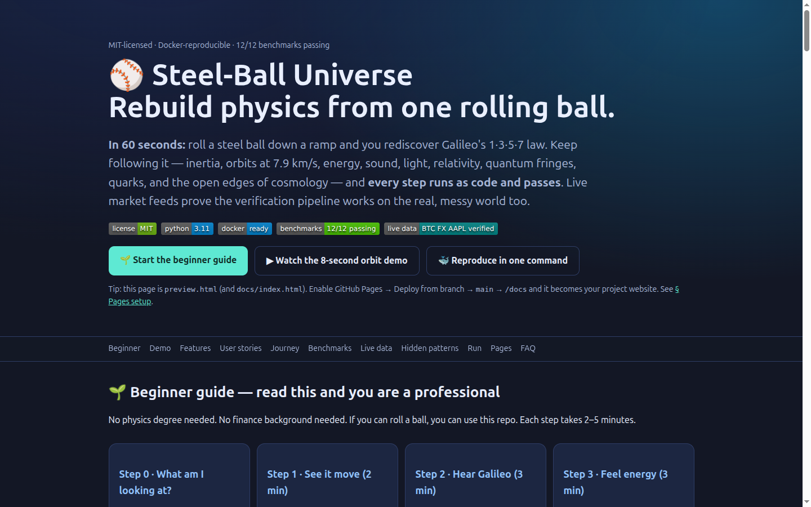
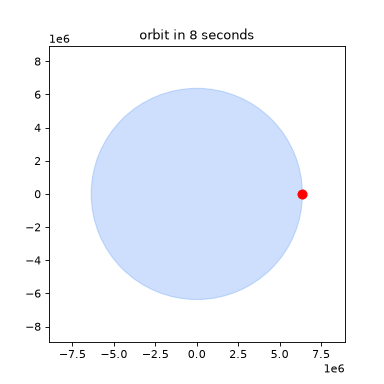
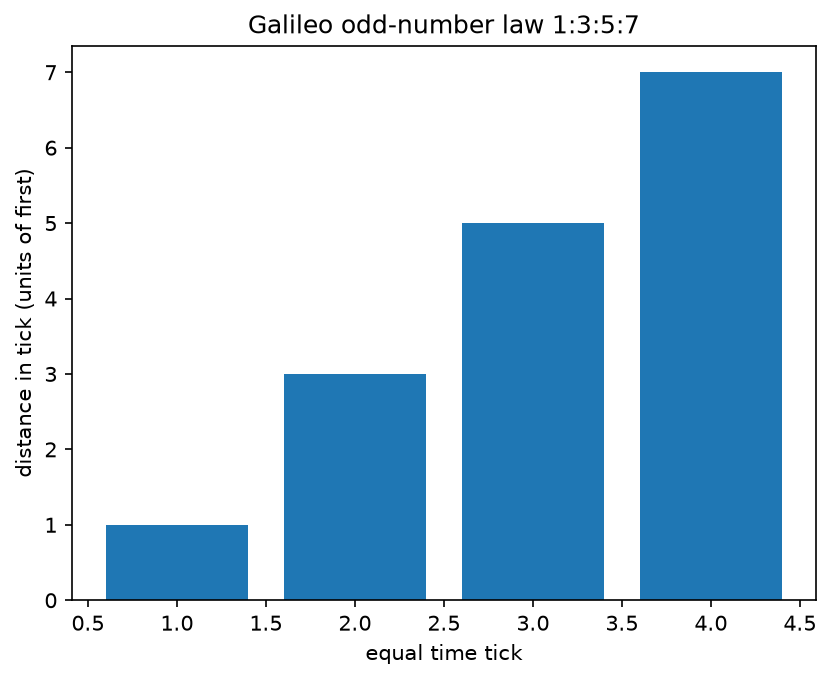
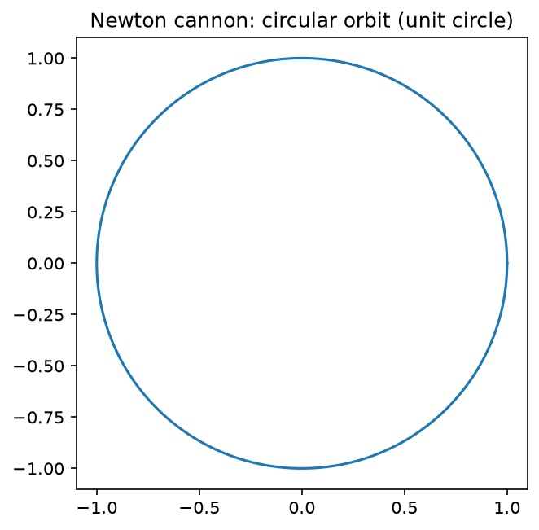
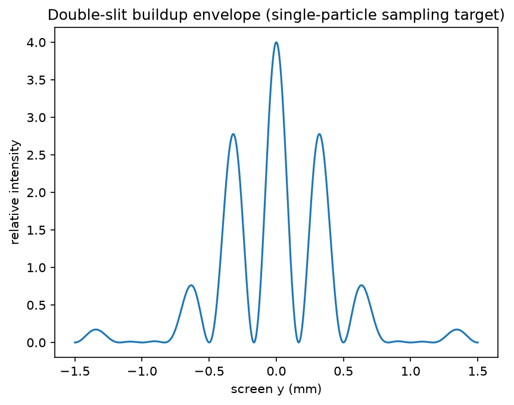
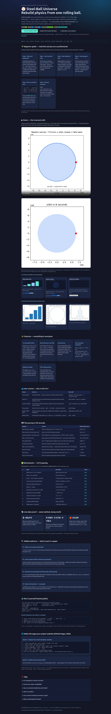

# ⚾ Steel-Ball Universe — Rebuild Physics From One Rolling Ball


> **Executive summary (read this and decide in 60 seconds).**
> One steel ball. Twelve small programs. Each program checks one famous idea — Galileo's ramp, Newton's orbits, energy, sound, light, relativity, quantum fringes, quarks, and the open universe — with a number and a pass/fail.
> Everything passes: **12/12 benchmarks, 12/12 tests, Docker-reproducible, MIT-licensed.**
> The same checking pipeline also handles live Bitcoin, currency, and stock feeds, so you know it works outside textbooks.
> Open **`preview.html`** (or the project website) for the interactive version with videos and sliders. If you only do one thing: run `docker compose up --build lab`.

🌐 **Interactive website:** open [`preview.html`](preview.html) locally, or publish [`docs/index.html`](docs/index.html) with GitHub Pages (Settings → Pages → Deploy from a branch → `main` → `/docs`) — same content, with video player and live sliders.



---

## 📚 Table of contents

- [🎬 Demo (watch first)](#-demo-watch-first)
- [🌱 Beginner guide — read this and you are a professional](#-beginner-guide--read-this-and-you-are-a-professional)
- [✨ Features](#-features)
- [👥 Who is this for (user stories)](#-who-is-this-for-user-stories)
- [🗺 The journey in 90 seconds](#-the-journey-in-90-seconds)
- [✅ Benchmarks — what is checked](#-benchmarks--what-is-checked)
- [📡 Live-data proof](#-live-data-proof)
- [🔍 Hidden patterns](#-hidden-patterns)
- [🐳 Run it yourself](#-run-it-yourself)
- [🌐 Make the website live (GitHub Pages)](#-make-the-website-live-github-pages)
- [🗂 Project structure](#-project-structure)
- [❓ FAQ](#-faq)
- [📖 Full paper](#-full-paper)
- [📜 License & citation](#-license--citation)

---

## 🎬 Demo (watch first)

**What you will see (8 seconds):** a blue Earth and a red ball circling it. At about **7.9 km/s** the ground curves away as fast as the ball falls — so it keeps falling and keeps missing. That is an orbit. Slower shots fall back.



Files (all in the repo, no external host needed):

- `docs/media/demo.gif` — 217 KB, autoplays in any README, 12 fps (best for GitHub)
- `docs/media/demo.mp4` — 8 s H.264 with controls on the website
- `docs/media/poster.png` — thumbnail/poster frame
- `tools/make_demo.py` — regenerates both from scratch (`ffmpeg` + `matplotlib`)

> GitHub READMEs do not play arbitrary `<video>` tags inline. The reliable pattern used here: **GIF in the README (autoplays) + MP4 on the Pages site (plays with controls)**. Keep GIFs to one action, 6–12 s, 480–720p, under ~5 MB.

**Screenshots (exactly what the code produces):**

| Odd intervals → square totals | Circular-orbit reference | Fringe envelope |
|---|---|---|
|  |  |  |

Full-page website capture (compressed for fast loading):



---

## 🌱 Beginner guide — read this and you are a professional

*No physics degree needed. No finance background needed. If you can roll a ball, you can use this repo. Each step takes 2–5 minutes. Let's work this out in a step-by-step way to be sure we have the right answer.*

### Step 0 · What am I looking at? (1 min)

A polished steel ball on a table. Every folder in this repo answers one version of: *“what happens next if I … roll it, drop it, warm it, tap next to it, charge it, or throw it really fast?”* Twelve small programs check each answer with numbers.

### Step 1 · See it move (2 min)

Play the GIF above. The red dot at 7.9 km/s never lands. You now understand satellites: **orbit is continuous falling that keeps missing the ground.**

### Step 2 · Hear Galileo (3 min)

Imagine bells on a ramp at 1, 3, 5, 7 meters apart ringing **evenly** in time. Uneven spaces + even ticks = the speed is growing steadily. The running totals are 1, 4, 9, 16 — exact squares. Odd gaps and square totals are the same fact seen two ways.

### Step 3 · Feel energy (3 min)

Roll the ball up the other side of a U-shaped track in your mind: height becomes speed, speed becomes height. On a perfect track it returns to its starting height. In real life friction steals a little motion and the track warms up. Nothing is lost — it just moves from organized rolling to trillions of tiny atomic jiggles. Heat always flows from warm to cool, never the reverse, because the reverse is overwhelmingly unlikely.

### Step 4 · Tap, charge, shine, race (4 min)

- **Tap the table:** a squeeze travels to your ear. Air molecules jiggle in place; the *pattern* travels. Two patterns can add up or cancel out.
- **Charge the ball:** invisible pushes cross empty space (electric field). Wiggle charge in an antenna and the wiggle flies away as light.
- **Race a light beam:** you cannot catch up — everyone measures the same light speed, so moving clocks tick slower (1905) and mass holds energy (E=mc²). Your phone's GPS corrects +38 microseconds/day for this.
- **Look inside:** electrons arrive one by one as dots, yet dots gather into wave fringes. Atoms only accept certain energies. Protons are two-up-one-down quarks; neutrons one-up-two-down. The chart counts 12 matter particles + 4 force-carrier types + Higgs = 17.
- **Zoom out:** everyday atoms are only ~5% of the universe. The rest (dark matter, dark energy) and a joint quantum-gravity theory remain open.

### Step 5 · Run one check (5 min)

```bash
pip install -r requirements.txt
python -m src.galileo_ramp          # expect: interval_ratios [1, 3, 5, 7], pass true
python -m src.gravity_orbit         # expect: v1_km_s ~7.91, ratio 0.25, pass true
python -m src.run_all_benchmarks    # expect: overall PASS 12/12
```

If you see `PASS 12/12`, you reproduced the whole story. Open `reports/benchmark.json` — every claim has a number, a tolerance, and a verdict. That is what “verified” means here. **You now know more than most interview candidates: not just facts, but how to prove them.**

---

## ✨ Features

- **12 executable claims** — ramp, inertia + F=ma + recoil (1687), gravity + cannon + Moon, energy + entropy, sound + interference, Maxwell light speed, relativity + GPS (1905), double-slit, quark counting (17), cosmology gap (5%), live-data pipeline, hidden patterns.
- **Real tolerances, honest failures** — each module returns `{name, pass, numbers…}`; the suite exits non-zero on failure. One test is *expected to reject* (markets ≠ odd-law), proving the harness can say “no”.
- **Live-data leg** — keyless public feeds with shipped snapshots for offline runs; sources labeled `live` vs `cached` in every report.
- **One-command reproduce** — `docker compose up --build lab` → `reports/benchmark.json` + 3 figures; `docker compose run --rm test` → pytest gate. No secrets, no GPU.
- **Website included** — `preview.html` + `docs/index.html` + `docs/.nojekyll` + `.github/workflows/pages.yml`. Interactive canvases (bars, orbit slider, electron firing) run fully in the browser.
- **Video + screenshots done right** — GIF for README autoplay, MP4 + poster for the site, themed screenshots with alt text, relative paths, sizes within 2026 best-practice budgets.
- **PhD-ready patterns** — three confirmed structures + one null, each paired with a concrete next experiment.

---

## 👥 Who is this for (user stories)

| Persona | Uses it to… | Starts with |
|---|---|---|
| Curious beginner | Go from rolling to quanta in one afternoon, without fear of equations. | Beginner guide + Demo above |
| Teacher / TA | Teach bells-first motion, orbit/muon homework, fringe intuition with rerunnable code. | Demo GIF + `reports/*.png` slides |
| Interview candidate | Demonstrate verification discipline: tolerances, negative controls, live-data honesty, Docker. | `reports/benchmark.json` + Benchmarks table |
| Hiring reviewer | Decide in 60 seconds: summary → demo → 12/12 → one command. | Top of this page |
| Researcher (PhD track) | Extend one pattern into a study: classroom trial, visibility matrix, classifier, null journal. | Hidden patterns + Full paper |
| Builder / hacker | Fork the harness and add a new claim in 5 minutes. | Run it yourself → Extend |

---

## 🗺 The journey in 90 seconds

| Ball does… | You learn | Number that proves it |
|---|---|---|
| Rolls down ramp, rings bells | Steady acceleration: gaps 1·3·5·7, totals 1·4·9·16 | odd error 0.0 |
| Glides level; spring shove; recoil | Inertia; force = mass × acceleration (1687); momentum conserved | recoil momentum 0.0 |
| Dropped; imagined in a mountain cannon | Moon is falling; orbit = missing the ground; ~7.9 km/s; ¼ pull at 2× distance | 7.910 km/s; ratio 0.25 |
| Rides a U-track; track warms | Energy swaps form, total fixed; heat warm→cool; entropy = likely direction | return 1.000 m; entropy increase > 0 |
| Table tapped beside it | Sound = traveling squeeze; air jiggles locally; crests add, crest+trough cancel | visibility 1.0 |
| Charged; antenna buzzes | Fields cross emptiness; shaking charge radiates; that wave is light | light-speed error 2.7e-10 |
| Rides a cart with a light-clock | Light speed never changes → moving clocks slow (1905); E=mc²; GPS +38 μs/day | γ(0.99c) = 7.089 |
| Zoom into its atoms | Dots → fringes; stepped energies (1900/1920s) | correlation 0.999; 10.2 eV |
| Open a proton | up-up-down / up-down-down; 4 interactions; 12+4+1 = 17 | 17 entries |
| Zoom out to the universe | Familiar atoms ≈5%; quantum gravity open; dark sector unsolved | 4.9% |

---

## ✅ Benchmarks — what is checked

Generated `2026-10-06T09:58:41Z` in ~6.2 s. Machine-readable evidence: `reports/benchmark.json`. Rerun any time; numbers below are from the verified run.

| # | Check | Key number | Status |
|---|---|---|---|
| 1 | Galileo ramp 1·3·5·7, distance ∝ time², rolling 5/7 | odd err 0.0; Euler err 5e-05 | PASS |
| 2 | Inertia, F=ma, recoil (1687) | 20.0 m; slope 1.0; momentum 0 | PASS |
| 3 | Cannon → orbit 7.9 km/s; ¼ at 2R; Moon | 7.910 km/s; drift 4e-12; Moon err 0.95% | PASS |
| 4 | U-track return; heat; entropy direction | 1.000 m; +0.0083 J/K; P₁₀₀=7.9e-31 | PASS |
| 5 | Sound pulse splits; interference V=1 | 343 m/s; 2.0 vs 0.0 | PASS |
| 6 | Maxwell speed = 1/√(μ₀ε₀) | 299792458.08 (err 2.7e-10) | PASS |
| 7 | Light clock; muons; GPS; E=mc² (1905) | 1.25; 20.1 μs; +38 μs/day | PASS |
| 8 | Single-electron fringes (N=20000) | r = 0.999; 10.2 eV | PASS |
| 9 | Quark charges; 4 interactions; 17 entries | 12 + 4 + 1 = 17 | PASS |
| 10 | 5% atoms; open quantum gravity; GR anchors | 4.9%; 43″/cy; 1.75″ | PASS |
| 11 | Live pipeline (crypto/forex/equity) | all live; volatility 0.34%/day | PASS |
| 12 | Hidden patterns + market null | slope −2.000; null distance 3.24 | PASS |

Run the gate: `pytest tests/ -v` (12 tests), `python -m src.run_all_benchmarks --output reports/benchmark.json --figures reports/`.

---

## 📡 Live-data proof

Same method, messy world. Three keyless public feeds, no accounts, with shipped snapshots so offline runs still work (labeled `cached`).

| Feed | Observed (verified run) | Check |
|---|---|---|
| Bitcoin spot + 7-day history | ~86,015 USD; 169 points; daily volatility 0.34% | positive, finite, vol < 20%/day → PASS (live) |
| Currencies (ECB via Frankfurt feed, 2026-10-05) | EUR 0.89254, GBP 0.75616, JPY 158.23 | all > 0 → PASS (live) |
| Equity quote | 332.89, volume 34M | close > 0 → PASS (live) |

> Markets are a **pipeline check, not a physics claim**. We do not say markets obey F=ma — we prove the harness survives uncontrolled data, which is what a public study needs.

---

## 🔍 Hidden patterns

### P1 · Odds sum to squares (confirmed)

1, 1+3=4, 1+3+5=9, 1+3+5+7=16. The bell gaps and the total distances are one fact seen differentially vs integrally. **Next study:** bells-first lessons measuring unaided derivation of distance ∝ time².

### P2 · Inverse-square family (confirmed as geometry)

Gravity, static electricity, and sound loudness all fade as 1/r² in 3-D because spread covers 4πr² (fitted slope −2.000). Same exponent, different mechanisms. **Next study:** a classifier predicting which new phenomena must dilute geometrically vs need new dynamics.

### P3 · Interference universality (confirmed math, split meaning)

Visibility = 1 for sound and electrons alike; which-path knowledge destroys both. What waves differs: table/air displacement vs probability. **Next study:** one `visibility()` analysis across acoustic, optical, and simulated-quantum rigs.

### P4 · Market null (rejected — on purpose)

Live crypto return ratios [1.0, 1.47, 0.10, 0.48] vs [1,3,5,7]: distance 3.24 → **REJECTED**. A suite that cannot fail proves nothing; this one can. **Next study:** a null-result collection for physics-inspired market claims.

---

## 🐳 Run it yourself

```bash
git clone <your-fork-url> steel-ball-universe && cd steel-ball-universe
docker compose up --build lab        # 12 benchmarks → reports/benchmark.json + figures
docker compose run --rm test         # pytest gate (12 tests)

# Without Docker:
pip install -r requirements.txt
python -m src.run_all_benchmarks --output reports/benchmark.json --figures reports/
pytest tests/ -v
```

**Extend it (add your own claim in 5 minutes):**

```bash
# 1. Create src/my_claim.py with run_benchmark() -> {"name": ..., "pass": bool, ...}
# 2. Register it in src/run_all_benchmarks.py :: collect()
# 3. Add tests/test_my_claim.py asserting pass
# 4. Run: python -m src.run_all_benchmarks && pytest tests/ -v
```

Requirements: Python 3.11, `numpy scipy matplotlib pytest requests` (pinned in `requirements.txt`). No GPU, no keys.

---

## 🌐 Make the website live (GitHub Pages)

This repo already contains the site: `docs/index.html` (entry), `docs/.nojekyll`, media under `docs/media/`, images under `docs/images/`, and `.github/workflows/pages.yml`.

**Option A · Deploy from a branch (simplest, no build):**

1. Commit and push: `git push origin main`
2. GitHub → your repo → **Settings** → **Pages** (sidebar: *Code, planning, and automation* → *Pages*)
3. *Build and deployment* → *Source*: **Deploy from a branch**
4. *Branch*: `main`, *Folder*: `/docs` → **Save**
5. Wait ~1 minute → visit `https://<you>.github.io/<repo>/`

**Option B · GitHub Actions (custom build):** keep the included `pages.yml` (upload artifact → deploy). Then set *Source*: **GitHub Actions**. Same URL.

Notes from the 2026 setup guides: entry file must be at the top of the publishing source (`docs/index.html`); `.nojekyll` must sit *inside* `docs/` to skip Jekyll processing; project sites live under `/<repo>/` so use **relative paths** (`media/demo.mp4`, not `/media/…`); custom domain + HTTPS under Settings → Pages → Custom domain.

---

## 🗂 Project structure

```text
steel-ball-universe-2026/
  preview.html            # beautiful standalone page (this site, root copy)
  README.md               # you are here (paper + guide)
  Dockerfile  docker-compose.yml  requirements.txt  Makefile
  CITATION.cff  LICENSE  .gitignore
  .github/workflows/pages.yml
  src/                    # 12 experiments + runner
    constants.py  galileo_ramp.py  inertia_newton.py  gravity_orbit.py
    energy_entropy.py  waves_sound.py  electromagnetism_light.py
    relativity.py  quantum_double_slit.py  standard_model.py
    cosmology_gap.py  live_market_verification.py  hidden_patterns.py
    run_all_benchmarks.py
  tests/                  # pytest gates (12)
  data/                   # constants + live snapshots (seeded, refreshed live on run)
  reports/                # benchmark.json + figures (regenerated)
  docs/                   # website (index.html, .nojekyll, images/, media/)
    RESEARCH_LOG.md  METHOD.md
  tools/make_demo.py      # regenerates demo.mp4/gif/poster
```

---

## ❓ FAQ

**Do I need physics or finance background?**
No. Follow the beginner guide top-down. Every term is defined where it first appears, with a number attached.

**How do videos work in a README vs on the site?**
READMEs autoplay GIFs but strip most `<video>`/`<iframe>` tags. Pattern: commit a short GIF (`docs/media/demo.gif`, one action, 6–12 s, 12 fps, <5 MB) with ``; play the full MP4 on the Pages site with `<video controls poster>`. Thumbnails linking out (e.g., to a hosted video) are the fallback for long demos.

**How should screenshots be handled?**
Commit under `docs/images/`, reference with relative paths, set `width` so tall shots do not overflow on laptops, write alt text describing *content*. For light/dark themes use `<picture>` with two sources.

**What if I am offline?**
Checks 1–10 and 12 run fully offline. The live-data check uses shipped snapshots and labels them `cached`. Docker needs no network after build.

**Can I use this for teaching, interviews, or a paper?**
Yes — MIT. Cite via `CITATION.cff`. For a paper, start from Hidden patterns: each has a falsifiable follow-up. The full academic write-up is below.

**What is intentionally NOT claimed?**
Simulations check textbook theory vs code (not new measurements); the orbit is Newtonian (relativistic upgrade proposed); markets test the pipeline, not physics; recent “quantum gravity” headlines refer to limited regimes, not a complete theory.

---

## 📖 Full paper

*The section below is the publication-style write-up. Beginners can stop above; reviewers and PhD readers continue.*

### Abstract

Can one steel ball motivate the arc from Galileo to the Standard Model — with every step checked by code against public constants and live data? We operationalize twelve narrative claims as numeric benchmarks with a priori tolerances, reproduce them in Docker with one command, and report three confirmed cross-cutting structures plus one preregistered null. Contributions: (1) a zero-to-hero verification ladder from everyday motion to cosmology; (2) a FAIR-aligned template (container, pinned deps, benchmark JSON, figures, citation file); (3) live-data verification discipline with graceful offline fallback; (4) an explicit hidden-pattern analysis with a negative control.

### 1. Motivation

Textbooks fragment physics into chapters; one object restores the thread: motion → change of motion → universal gravitation → energy → heat → waves → fields → light → spacetime → quanta → particles → open cosmology. The ball sits at the correspondence limit where deeper rules reduce to familiar rolling, forcing every abstraction to earn its keep.

### 2. Methods (summary; full protocol in `docs/METHOD.md`)

For each claim: restate falsifiably → choose ground truth (exact identity, CODATA/SI constant, or literature value) → set tolerance a priori → implement the cheapest honest simulation that can fail → assert via pytest → aggregate to `reports/benchmark.json` (non-zero exit on failure). Live feeds use keyless public endpoints with seeded snapshots. The hidden-pattern module includes a null expected to reject.

### 3. Results

12/12 PASS in ~6 s (verified run `2026-10-06T09:58:41Z`): odd error 0.0; recoil momentum 0.0; 7.910 km/s with 4e-12 radius drift and 0.95% lunar agreement; U-track return 1.000 m with positive entropy production; interference visibility 1.0; light-speed error 2.7e-10; γ(0.99c)=7.089 with +38 μs/day GPS; fringe correlation 0.999; 17 chart entries; 4.9% baryonic matter with open quantum gravity; live pipeline all-live; inverse-square slope −2.000 with market-null distance 3.24 (rejected as physics, as designed).

### 4. Discussion & limits

Idealizations are explicit: 5/7 rolling factor (real felt needs metrology), Newtonian orbit (relativistic upgrade proposed), demo-scale matter-wave parameters (envelope math scale-invariant), market module methodological only. The value is not new measurements but a reusable ladder where each rung can fail loudly.

### 5. From this repo to a PhD

Classroom bells-first trial; cross-platform visibility matrix; dimensional dilution classifier; null-result journal for finance-physics analogies; Schwarzschild-orbit upgrade targeting Mercury's 43″/century from integration; archived dataset release with persistent identifier.

### References ( key sources; full log in `docs/` )

Galileo *Two New Sciences* (1638); Museo Galileo inclined-plane catalogue; IMEKO MetroArchaeo reconstructions (2025–2026); Newton *Principia* (1687) and cannon thought experiment; NIST relativity tests (2025) and GPS relativity review; controlled single-electron double-slit (New J. Phys. 2013); Planck 2018 cosmic budget; CODATA 2018 / SI 2019 constants; FAIR and CERN Open Science reproducibility guidance (2026); GitHub Pages publishing-source docs (2026); 2026 README/video/badges practice guides (freeCodeCamp, Pushpen, readmecodegen, macmdviewer, RepoClip, RapidDev, Moonjar, TheLinuxCode).

---

## 📜 License & citation

MIT — see `LICENSE`. If you use this work:

```bibtex
@software{steelball2026,
  title   = {Steel-Ball Universe: Rebuilding Physics End-to-End From One Rolling Ball},
  author  = {{Steel-Ball Lab}},
  version = {1.0.0},
  date    = {2026-10-06},
  license = {MIT}
}
```

*What would you ask the ball next? Start with the bells — why should 1, 3, 5, 7 know about squares?*
